# PRD — OneSubscribe

---

## 1. Project Overview / Product Vision

**Nama Project:** OneSubscribe

**Deskripsi:**
OneSubscribe adalah platform marketplace langganan digital yang memudahkan pengguna mendapatkan akses ke berbagai layanan teknologi premium seperti AI tools, Firebase, Cloudflare, server/VPS, dan lainnya hanya dalam satu tempat. User cukup memilih layanan, mengisi form, melakukan pembayaran, dan tim OneSubscribe akan mengaktifkan langganan serta mengirimkan kredensial langsung via WhatsApp dan email.

**Latar Belakang:**
Banyak orang kesulitan berlangganan layanan digital premium karena harus menggunakan kartu kredit atau metode pembayaran internasional yang tidak semua orang miliki. OneSubscribe hadir sebagai jembatan yang memudahkan siapa saja mendapatkan akses layanan digital premium dengan metode pembayaran lokal yang mudah dan familiar.

**Target User:** Umum — siapa saja yang membutuhkan layanan digital premium tanpa proses yang rumit.

---

## 2. Problem Statement & Goals

### Problem Statement
- Banyak orang kesulitan berlangganan layanan digital premium karena harus bayar menggunakan kartu kredit/PayPal luar negeri
- Proses aktivasi yang rumit dan membingungkan bagi user awam
- Harus berlangganan satu per satu di banyak platform berbeda

**Dampak jika tidak diselesaikan:**
- User kehilangan akses ke tools produktivitas penting
- Potensi pasar besar yang tidak terlayani karena keterbatasan metode pembayaran

### Goals
- Menyediakan akses layanan digital premium dalam 1 platform yang simpel
- Mempermudah pembayaran dengan metode lokal (transfer, QRIS, dll)
- Aktivasi cepat, kredensial langsung dikirim via WA & email
- Menjangkau user umum yang tidak familiar dengan pembayaran internasional

### Success Metric
- 50 order masuk di bulan pertama
- Response & aktivasi maksimal 1x24 jam setelah pembayaran
- 80% customer satisfaction berdasarkan feedback WA
- 100 user terdaftar di bulan pertama

---

## 3. User Personas / Roles

### Customer (User)
- **Deskripsi:** Pengunjung umum yang ingin membeli langganan digital premium
- **Hak Akses:**
  - Lihat landing page & katalog tanpa login
  - Register & login via email & password
  - Akses checkout setelah login
  - Lihat dashboard pribadi (riwayat order, sisa durasi, profil)
- **Tujuan:** Membeli dan memantau langganan digital dengan mudah dan cepat

### Admin (Lo & Tim)
- **Deskripsi:** Operator OneSubscribe yang mengelola seluruh operasional platform
- **Hak Akses:** Akses penuh ke semua fitur dashboard admin
- **Tujuan:** Mengelola produk, memproses order, mengaktifkan langganan, dan memantau performa platform

---

## 4. Scope & Deliverables (MVP Scope)

### In Scope
- Landing page & katalog produk (public, tanpa login)
- Register & login user (email & password, wajib sebelum checkout)
- Halaman detail produk
- Form order + checkout
- Sistem saldo durasi otomatis (auto-deduct per bulan, notif sisa 1 bulan)
- Payment gateway (Pakasir + Midtrans)
- Dashboard user (riwayat order, sisa durasi/saldo, profil)
- Dashboard admin (kelola produk, kelola order, kelola user, laporan, pengaturan)
- Notifikasi otomatis via WA & email (order masuk, aktivasi, reminder perpanjang)
- Aktivasi langganan manual oleh admin
- Pengiriman kredensial via WA & email oleh admin

### Out of Scope
- Mobile app (iOS/Android)
- Fitur live chat / support ticket
- Affiliate / referral system
- Auto aktivasi (semua aktivasi manual oleh tim)
- Multi-bahasa

### Deliverables
- Source code lengkap
- Dokumentasi teknis
- Deployment ke VPS
- Panduan penggunaan admin

---

## 5. Platform & Design

### Platform
- **Web Only**

### Mobile Approach
- N/A — Web only, tidak ada mobile app di MVP

### Design Theme / Style
- **Mood:** Modern, minimalis, estetik
- **Warna:** Clean, dominan putih/cream dengan aksen gelap (hitam/navy)
- **Font:** Sans-serif modern (Inter / Plus Jakarta Sans)
- **Feel:** Clean, elegan, trustworthy
- **Referensi:** Figma.com

---

## 6. Menu & Features List

### Customer (User)

#### Menu: Home / Katalog
- Lihat landing page
- Browse katalog produk (tanpa login)
- Filter produk berdasarkan kategori (AI, Cloud, Server, dll)
- Search produk
- Klik produk → masuk halaman detail

#### Menu: Detail Produk
- Lihat nama, deskripsi, harga, durasi langganan
- Tombol "Order Sekarang"
- Redirect ke login jika belum login

#### Menu: Order / Checkout
- Form otomatis terisi dari data akun (nama, email, WA)
- Lihat keterangan saldo/sisa durasi jika punya langganan aktif
- Pilih metode pembayaran (Pakasir / Midtrans)
- Tombol "Bayar Sekarang"
- Redirect ke halaman pembayaran

#### Menu: Riwayat Order
- List semua order (nama produk, tanggal, status, harga)
- Filter berdasarkan status (Menunggu Aktivasi, Aktif, Expired)
- Klik order → lihat detail order & sisa durasi/saldo
- Indikator sisa bulan langganan per produk

#### Menu: Profil & Pengaturan
- Lihat & edit data diri (nama, email, no WA)
- Ganti password
- Logout

---

### Admin

#### Menu: Dashboard
- Statistik total order hari ini / bulan ini
- Total revenue
- Jumlah user aktif
- Jumlah order pending (belum diaktivasi)
- Notifikasi order masuk terbaru

#### Menu: Kelola Produk
- List semua produk
- Tambah produk baru (nama, deskripsi, harga, durasi, kategori, gambar)
- Edit produk
- Hapus produk
- Aktifkan / nonaktifkan produk (tampil/sembunyi di katalog)
- Filter & search produk

#### Menu: Kelola Order
- List semua order masuk
- Filter by status (Pending, Aktif, Expired)
- Filter by tanggal
- Klik order → lihat detail (nama, email, WA user, produk yang dipesan)
- Update status order
- Input & kirim kredensial ke WA & email user
- Catat log pengiriman kredensial

#### Menu: Kelola User
- List semua user terdaftar
- Search user by nama / email
- Lihat detail user & history order
- Blokir / aktifkan akun user

#### Menu: Laporan
- Total order & revenue per periode
- Filter by tanggal / bulan
- Export data ke Excel/CSV

#### Menu: Pengaturan
- Setting website (nama, logo, kontak)
- Template notifikasi WA & email
- Koneksi payment gateway (Pakasir & Midtrans)

---

## 7. User Flow / Workflow

### Flow User — Home / Katalog

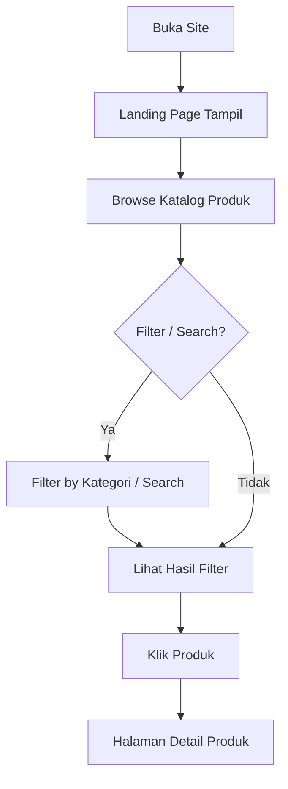

---

### Flow User — Detail Produk

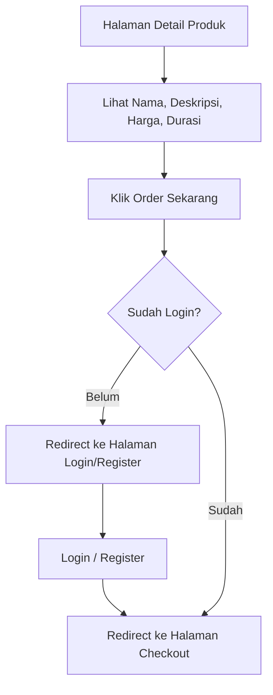

---

### Flow User — Order / Checkout

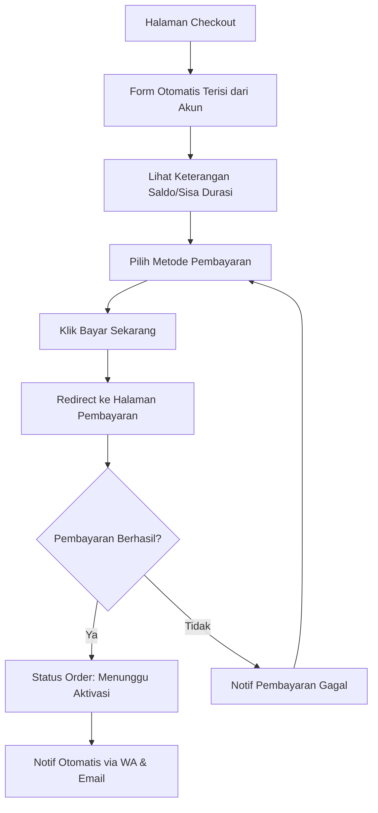

---

### Flow User — Riwayat Order

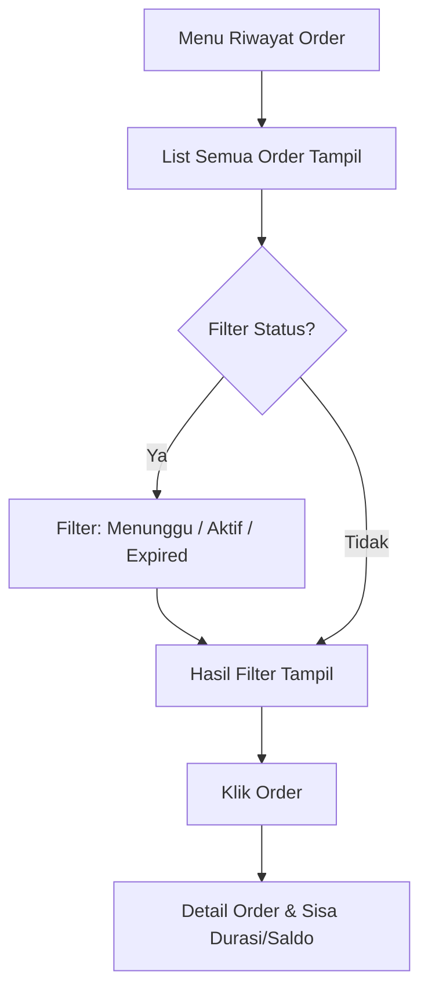

---

### Flow User — Profil & Pengaturan

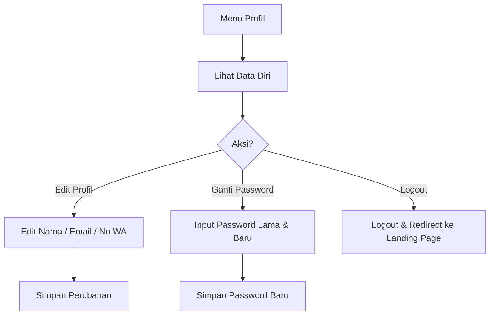

---

### Flow Admin — Dashboard

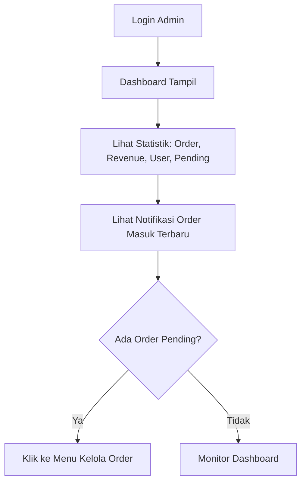

---

### Flow Admin — Kelola Produk

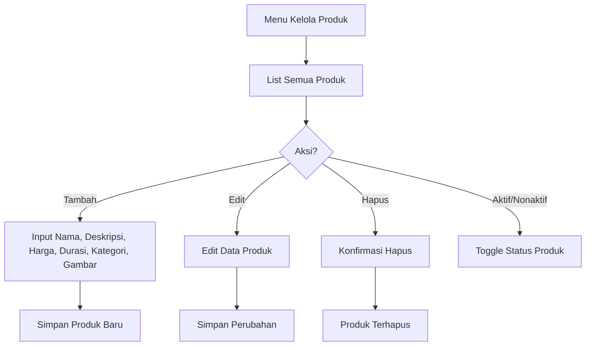

---

### Flow Admin — Kelola Order

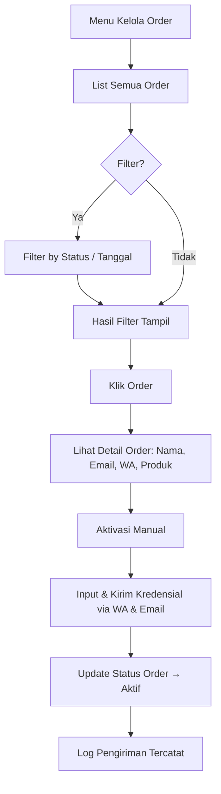

---

### Flow Admin — Kelola User

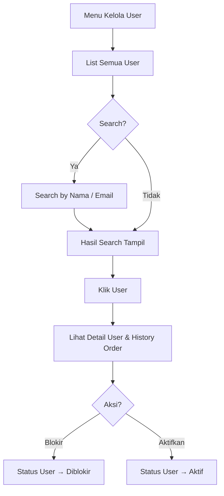

---

### Flow Admin — Laporan

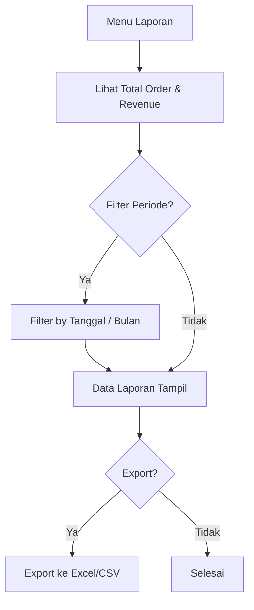

---

### Flow Admin — Pengaturan

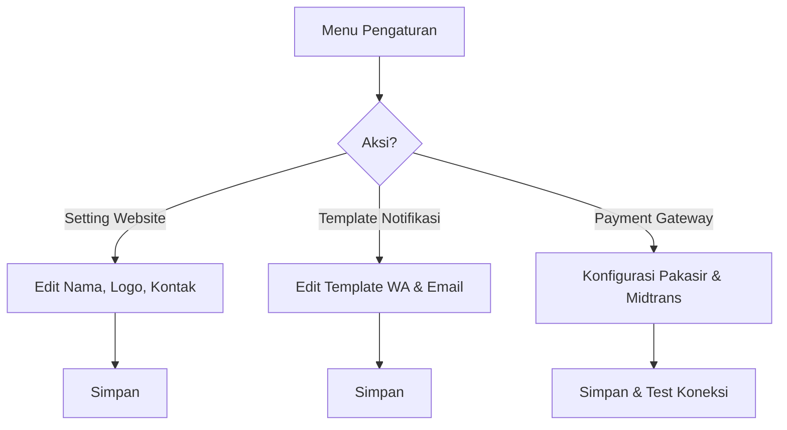

---

### Flow Sistem — Auto Deduct Saldo Durasi

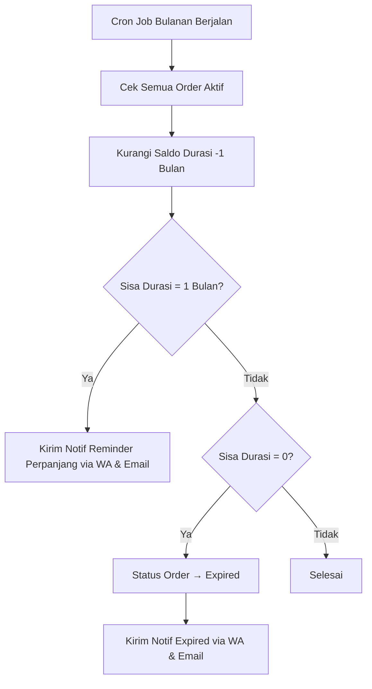

---

## 8. Functional Requirements

### Authentication
- User wajib register & login via email & password sebelum checkout
- Landing page & katalog bisa diakses tanpa login
- Redirect ke halaman login saat klik "Order Sekarang" jika belum login
- Admin login via halaman terpisah (/admin)
- Role: Customer & Admin
- Session management dengan JWT / cookie

### Validasi Form
- **Register:** nama wajib diisi, email valid, password minimal 8 karakter
- **Checkout:** nama, email, no WA wajib terisi otomatis dari akun
- **Order:** tidak bisa disubmit jika pembayaran belum selesai
- **Produk (Admin):** nama, harga, durasi, kategori wajib diisi

### Notifikasi
- WA otomatis ke user saat order masuk (via Fonnte)
- WA otomatis ke user saat kredensial sudah dikirim
- WA otomatis ke user saat saldo durasi tinggal 1 bulan (reminder perpanjang)
- WA otomatis ke user saat langganan expired
- Email otomatis ke user saat order masuk & aktif (via Resend)
- Notifikasi ke admin saat ada order masuk baru

---

## 9. Business Process

### Proses yang Diotomasi Sistem
- Konfirmasi pembayaran via Pakasir & Midtrans (webhook)
- Status order otomatis berubah jadi "Menunggu Aktivasi" setelah bayar
- Notif WA & email ke user setelah bayar (otomatis)
- Auto-deduct saldo durasi setiap bulan (cron job)
- Notif reminder perpanjang saat saldo tinggal 1 bulan
- Status order otomatis berubah jadi "Expired" saat saldo 0

### Proses Manual (Admin & Tim)
- Aktivasi langganan user
- Input & kirim kredensial via WA & email
- Update status order → "Aktif"

### Approval Flow
```
User Bayar
    → Sistem Konfirmasi Otomatis (Webhook Payment)
    → Status: Menunggu Aktivasi
    → Notif Masuk ke Admin
    → Admin Aktivasi Manual
    → Admin Kirim Kredensial via WA & Email
    → Admin Update Status → Aktif
    → Sistem Jalankan Auto-deduct Bulanan
    → Notif Reminder saat Sisa 1 Bulan
    → Status Expired saat Saldo 0
```

### Audit Trail
- Semua order tersimpan di database (tanggal order, status, history perubahan status)
- Log aktivitas admin (siapa yang update status & kapan)
- History pengiriman kredensial tercatat di sistem
- Log perubahan saldo durasi per bulan

---

## 10. Technical Stack & Integration

### Technical Stack
- **Frontend + Backend:** TanStack Start (Fullstack)
- **Database:** PostgreSQL
- **Hosting/Infra:** VPS + Dokploy

### Integrasi Pihak Ketiga
- **Storage:** RustFS (S3-compatible, self-hosted)
- **Payment Gateway:** Pakasir + Midtrans
- **WA Gateway:** Fonnte
- **Email Service:** Resend
- **Maps:** N/A

---

## 11. Security Requirements

### Enkripsi Data Sensitif
- Password user di-hash dengan bcrypt
- Data kredensial user dienkripsi di database
- HTTPS wajib di semua endpoint
- Environment variable untuk semua API key & secret

### Rate Limiting & Proteksi API
- Rate limiting di endpoint login & register (cegah brute force)
- Rate limiting di endpoint order & payment
- CSRF protection
- Input sanitization di semua form

### Backup & Recovery
- Backup database otomatis setiap hari
- Backup disimpan di storage terpisah
- Recovery maksimal 1x24 jam jika terjadi insiden

### Compliance
- Data user (nama, email, WA) tidak dibagikan ke pihak ketiga
- Kredensial user hanya dikirim ke WA & email terdaftar milik user

---

## 12. Monetization

### Model Bisnis
- **Direct Selling** — user beli langganan digital langsung via platform
- Margin keuntungan dari selisih harga beli & harga jual layanan

### Pricing
- Harga per produk ditentukan & diubah oleh admin secara fleksibel
- Tidak ada subscription fee untuk user (bayar per layanan)
- Durasi langganan tergantung produk (bulanan / tahunan)
- Sistem saldo durasi otomatis terkurangi setiap bulan

---

## 13. KPI / Metrics

| Metric | Target |
|---|---|
| Total order bulan pertama | 50 order |
| User terdaftar bulan pertama | 100 user |
| Response & aktivasi order | Maks. 1x24 jam |
| Customer satisfaction | 80% feedback positif via WA |
| Repeat order bulan ke-2 | 20% dari total user |
| Uptime platform | 99% |

---

## 14. Timeline / Roadmap

| Fase | Kegiatan | Durasi |
|---|---|---|
| **Fase 1 — Setup & Foundation** | Setup project, database, VPS, domain, Dokploy, integrasi Pakasir, Midtrans, Fonnte, Resend, RustFS | Minggu 1 |
| **Fase 2 — Development Core** | Landing page, katalog, register/login, detail produk, checkout, integrasi payment, notifikasi WA & email, dashboard user, dashboard admin, sistem auto-deduct saldo durasi | Minggu 2–3 |
| **Fase 3 — Testing & Launch** | UAT, bug fixing, optimasi performa & keamanan, deployment, launch | Minggu 4 |

**Target Selesai:** 1 bulan dari kickoff

---

## 15. UAT & Maintenance

### Skenario UAT (Checklist)

**User:**
- [ ] Register user baru berhasil
- [ ] Login user berhasil
- [ ] Landing page & katalog tampil tanpa login
- [ ] Redirect ke login saat klik order tanpa login
- [ ] Checkout & pembayaran via Pakasir berhasil
- [ ] Checkout & pembayaran via Midtrans berhasil
- [ ] Notif WA & email terkirim setelah order berhasil
- [ ] Status order tampil di dashboard user
- [ ] Sisa saldo durasi tampil & berkurang tiap bulan
- [ ] Notif reminder perpanjang saat sisa 1 bulan
- [ ] Status expired saat saldo 0
- [ ] Edit profil & ganti password berhasil

**Admin:**
- [ ] Login admin berhasil via /admin
- [ ] Dashboard statistik tampil dengan benar
- [ ] Tambah, edit, hapus produk berhasil
- [ ] Aktifkan/nonaktifkan produk berhasil
- [ ] List order masuk tampil dengan benar
- [ ] Filter order by status & tanggal berfungsi
- [ ] Update status order berhasil
- [ ] Kirim kredensial via WA & email berhasil
- [ ] List user tampil & search berfungsi
- [ ] Blokir/aktifkan user berhasil
- [ ] Laporan & export Excel/CSV berhasil
- [ ] Setting website, template notif, payment gateway tersimpan

### Periode Support Pasca-Launch
- Free bug fix selama 1 bulan setelah launch

### SLA Maintenance
- Response time bug critical: maksimal 1x24 jam
- Backup database: setiap hari otomatis
- Uptime target: 99%
